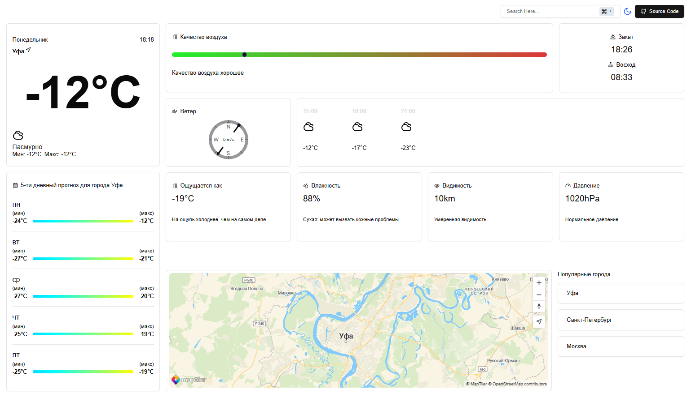

Приложение для просмотра погоды.

Используемые API:

- OpenWeatherMap (https://openweathermap.org)
- MapTiler (https://maptiler.com)

Используемые библиотеки и технологии:

- webApi
- axios
- Next.js
- TypeScript
- TailwindCSS
- React
- React-icons(Lucide React)
- React-moment(Moment.js)
- React-router-dom(Next.js)
- shadcn/ui

Для получение данных о погоде и координатах города используется API OpenWeatherMap.
Создайте файл .env и добавьте в него ваш API ключ:
OPENWEATHERMAP_API_KEY=YOUR_API_KEY

